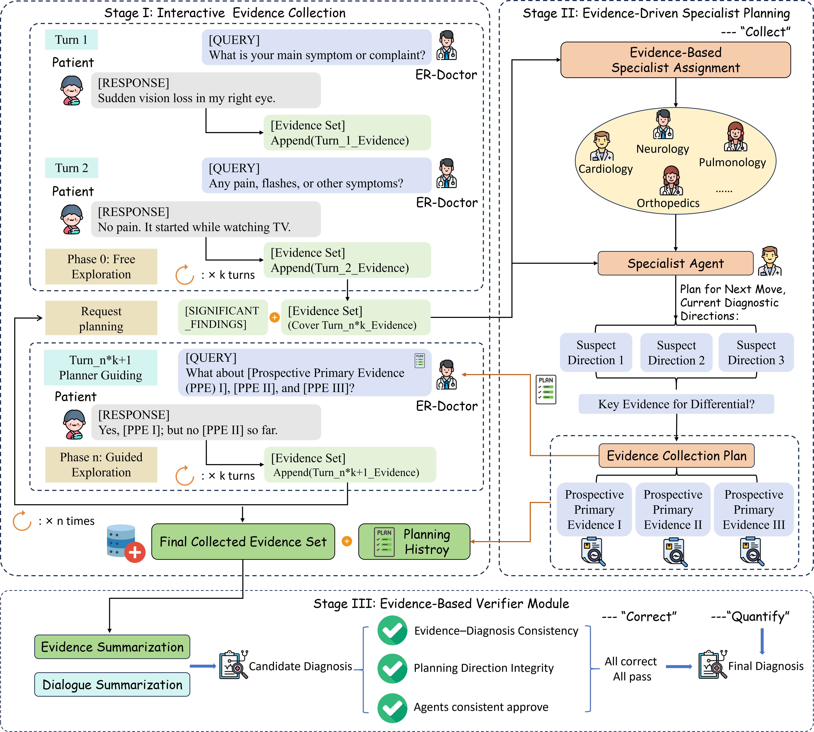

<h1 align="center">Quantify-Collect-Correct<br>Evidence-Driven Multi-Agent Framework for<br>Critical Evidence Refinement in Emergency Rooms</h1>

<h2 align="center">MICCAI 2026 — Early Accept</h2>

<p align="center">
  <em>Haoyu Cao, Yueze Fu, Wenbo Gao, Yuxin Lin, Xiangyu Li, Wei Wang</em><br>
  <em>Harbin Institute of Technology, Shenzhen · Harbin Institute of Technology · The Hong Kong Polytechnic University</em>
</p>

<p align="center">
  
</p>

---

## Overview

Emergency-room (ER) decision-making is characterized by high clinical risk, strict time constraints, and rapidly evolving yet incomplete evidence. We propose **QCC**, a closed-loop multi-agent diagnostic framework that treats **evidence as a first-class optimization target** in interactive clinical reasoning. QCC couples multi-turn dialogue with evidence-level feedback through three stages:

**Weighted Evidence Convergent Index (WECI)** that importance-weights collected evidence to measure how well the system captures decision-critical signals during interaction. Unlike coverage-only metrics (PC/EC/ICR) that treat all evidence equally, WECI accounts for heterogeneous clinical importance: missing a small number of high-significance cues can be more detrimental than omitting many low-impact details. WECI is computed as:

  $$\text{WECI} = \frac{\sum_{e \in E \cap E^*} w_e}{\sum_{e \in E^*} w_e}$$

  where $E$ is the collected evidence set, $E^*$ is the ground-truth evidence set curated by specialist clinicians, and $w_e \in [0, 1]$ denotes the importance weight of evidence item $e$, estimated by an evidence evaluation agent $\phi_{EA}(\cdot)$ conditioned on retrieval-augmented specialist knowledge. WECI is computed inline alongside ICR and ACC in a single `qcc-eval` run — see [`src/qcc/weci.py`](src/qcc/weci.py) and [`weci_configuration.md`](weci_configuration.md).


---

## Agent Architecture

QCC deploys **8 agent roles** across the Quantify–Collect–Correct closed loop. Each agent has a well-defined responsibility, prompt template, and optional RAG interface.

### Agent Inventory

| # | Agent | Role ID | Responsibility | RAG Interface | Multi-Turn |
|---|-------|---------|---------------|:---:|:---:|
| 1 | **ER-Doctor** | `doctor` | History-taking, exam ordering, diagnosis proposal; autonomously decides when to finish | — | ✓ |
| 2 | **Patient Simulator** | `patient` | Reveals patient-background facts on demand, with `[REFERENCE]` index tracking | — | ✓ |
| 3 | **Reporter Simulator** | `reporter` | Reveals exam/test facts on demand, with index tracking | — | ✓ |
| 4 | **Router** | `router` | Reads S_obs → selects top-N specialists from pool | — | ✗ (single-shot) |
| 5 | **Specialist (×N)** | `specialist_{id}` | Each proposes 1 Prospective Primary Evidence (PPE) from its specialty perspective | ✓ `KnowledgeRetriever` | ✗ (single-shot) |
| 6 | **Summarizer** | `summarizer` | Condenses dialogue history into structured clinical summary | — | ✗ |
| 7 | **Diagnostician** | `diagnostician` | Produces candidate diagnosis + confidence level `[CONFIDENCE]` | — | ✗ |
| 8 | **Verifier** | `diagnostician_verifier` | EBVM: checks Evidence–Diagnosis consistency, Planning Direction integrity; feeds back to Doctor/Planner | — | ✗ |
| 9 | **Planner** (fallback) | `planner` | Generic Planner used when specialist routing is disabled; produces SystemDirections + PPEs | — | ✓ |
| 10 | **Consistency Agent** | `consistency_agent` | EBVM Criterion 3: checks agreement between Diagnostician confidence and Verifier assessment | — | ✗ |
| 11 | **Evaluation Agent (ϕ_EA)** | — (post-hoc) | Scores each evidence item's diagnostic importance (0–1) given GT diagnosis; runs after dialogue ends | ✓ `KnowledgeRetriever` | ✗ |


### EDPM Specialist Pool (10 Specialties)

| ID | Specialist | Focus | Key Evidence |
|----|-----------|-------|-------------|
| `cardiology` | Cardiology | Chest pain, arrhythmias, heart failure, valvular disease | ECG, troponin, BNP, echocardiogram |
| `neurology` | Neurology | Headache, seizure, stroke, altered mental status, neuropathy | CT head, MRI brain, lumbar puncture, EEG |
| `pulmonology` | Pulmonology | Dyspnoea, cough, respiratory failure, PE, pneumonia | Chest X-ray, CT chest, ABG, D-dimer |
| `gastroenterology` | Gastroenterology | Abdominal pain, GI bleeding, jaundice, pancreatitis | Abdominal CT, LFTs, lipase, endoscopy |
| `nephrology` | Nephrology | AKI, electrolyte disorders, haematuria, acid–base | BUN, creatinine, eGFR, urinalysis |
| `infectious_disease` | Infectious Disease | Fever of unknown origin, sepsis, meningitis | Blood cultures, CRP, procalcitonin, serologies |
| `orthopedics` | Orthopedics | Fractures, joint pain, back pain, trauma | X-ray, CT, MRI, joint aspiration |
| `endocrinology` | Endocrinology | Diabetes, thyroid, adrenal insufficiency | Blood glucose, HbA1c, TSH, cortisol |
| `hematology` | Hematology | Anaemia, bleeding disorders, leukaemia, lymphoma | CBC, coagulation panel, peripheral smear |
| `general_emergency` | General Emergency Medicine | Undifferentiated emergencies, shock, toxicology | Vital signs, POCUS, ECG, basic labs |

All 10 specialists support an optional `KnowledgeRetriever` (RAG) interface — attach per-specialist or shared retrievers via `SpecialistPool.attach_retriever()`.

### RAG Interface

Any agent marked with ✓ RAG above accepts a `KnowledgeRetriever` at construction time:

```python
from qcc.weci import KnowledgeRetriever

class MyRetriever(KnowledgeRetriever):
    def retrieve(self, diagnosis: str, evidence: str) -> str:
        # Query your vector DB, PubMed, MedCPT, etc.
        return "relevant medical knowledge..."

# Per-specialist RAG
pool = SpecialistPool.default()
pool.attach_retriever_to("cardiology", MyRetriever())

# Shared RAG across all specialists
pool.attach_retriever(MyRetriever())

# Evaluation Agent with RAG
eval_agent = EvaluationAgent(model_name="gpt-4o-mini", retriever=MyRetriever())
```

When no `KnowledgeRetriever` is attached (default), agents rely purely on their prompt + base LLM capability.

### Evaluation Agent (ϕ_EA) Working Mode

ϕ_EA operates **post-hoc** — after the multi-agent dialogue terminates:

1. **Input**: GT diagnosis + all atomic patient/exam facts of the case
2. **LLM Call**: A single prompt batches all evidence items; ϕ_EA assigns each item a weight $w_e \in [0, 1]$ according to:
   - 1.0 = Pathognomonic / gold-standard
   - 0.7–0.9 = Highly discriminative
   - 0.4–0.6 = Moderately helpful
   - 0.1–0.3 = Marginally relevant
   - 0.0 = Irrelevant
3. **Output**: `AnnotatedSample` with per-item `{index, text, weight, collected, category}`
4. **WECI Computation**: $\text{WECI} = \frac{\sum_{e \in E \cap E^*} w_e}{\sum_{e \in E^*} w_e}$ using collected indices extracted from the dialogue trace

Per-case evidence weights are saved to both `result.json` (summary) and `record_*/` (full trace), enabling per-item audit of evidence importance and collection efficiency.

### Verifier EBVM — Three Criteria

| Criterion | Description | Implementation |
|-----------|-------------|---------------|
| 1. Evidence–Diagnosis Consistency | Does collected evidence support the diagnosis without contradictions? | Verifier `[EVIDENCE_ASSESSMENT]` section |
| 2. Planning Direction Integrity | Did the Planner remain balanced, or narrow prematurely? | Verifier `[PLANNER_ASSESSMENT]` section |
| 3. Agents Consistent Approve | Agreement between Diagnostician confidence and Verifier assessment | `ConsistencyAgent` (pluggable, defaults to `CONSISTENT`) |

### Configuration

| Parameter | Default | Description |
|-----------|---------|-------------|
| `free_exploration_turns` (K) | 3 | Free turns before first EDPM intervention |
| `num_specialists` (N) | 3 | Specialists selected by Router per intervention |
| `PLANNER_INTERVAL` | 3 | Turns between periodic re-planning |
| `enable_specialist_routing` | `True` | When `False`, falls back to generic Planner agent |
| `consistency_agent` | `ConsistencyAgent()` | Pluggable; defaults to always-CONSISTENT |

---

## Quickstart

### 1) Install

```bash
git clone <repo-url>
cd qcc-framework

uv venv --python 3.12
source .venv/bin/activate
uv pip install -e .
```

### 2) Configure API

```bash
cp .env.example .env
# edit .env with your endpoint:
# OPENAI_API_BASE_URL=...
# OPENAI_API_KEY=...
```

### 3) Run

```bash
# QCC evaluation (our method)
qcc-eval --datasets medqa --modes qcc \
  --doctor-model gpt-5-mini \
  --max-turns 16 \
  --max-items 200

# Baseline modes are also supported
qcc-eval --datasets medqa --modes cot roleplay react sc refine \
  --doctor-model gpt-5-mini \
  --max-turns 16 \
  --max-items 200
```

---

## Running Evaluations

```bash
# Full evaluation across datasets and strategies
qcc-eval --datasets medqa diagnosisarena rarearena derm \
  --modes cot roleplay react sc refine qcc \
  --doctor-model gpt-5-mini \
  --skip-existing \
  --max-turns 16 \
  --max-items 200 \
  --max-workers 50
```

### Available Modes

| Mode | Description |
|------|-------------|
| `cot` | Chain-of-Thought — one-shot reasoning with full evidence (upper bound) |
| `roleplay` | Multi-turn doctor-patient-reporter interaction |
| `react` | ReAct-style reasoning + acting with explicit [THOUGHT] before each action |
| `sc` | Summarizer-Diagnostician pipeline with separate evidence-gathering and diagnosis |
| `refine` | SC + Verifier feedback loop for incomplete diagnoses |
| `qcc` | **QCC framework** — Progressive Planner with system-level directions + evidence-driven verification |

---

## Datasets

Sample datasets are sourced from public benchmarks. The repository includes a segmented version of **AgentClinic-MedQA** under `data/` as a reference. Additional comparison datasets used in our experiments can be obtained from their original sources:

| Dataset | Source | Task Type | Included |
|---------|--------|-----------|----------|
| AgentClinic-MedQA | [Schmidgall et al., AgentClinic](https://github.com/SamuelSchmidgall/AgentClinic) | Single Diagnosis | ✓ `agentclinic_medqa_segmented.jsonl` |

For ER-specific evaluation, we also benchmark on [**MIMIC-IV-ED**](https://physionet.org/content/mimic-iv-ed/) and [**ER-REASON**](https://physionet.org/content/er-reason/) (both from PhysioNet). Data processing follows the approach in [EID-Benchmark](https://github.com/NanshineLoong/EID-Benchmark).

### Add your own dataset

```bash
qcc-segment --dataset path-to-your-jsonl \
  --fields case_vignette \
  --model gpt-5-mini \
  --max-items 200 \
  --workers 10 \
  --out your-output-dataset-file
```

---

## Metrics

This framework evaluates both evidence acquisition quality and final diagnostic accuracy:

| Metric | Description | Status |
|--------|-------------|--------|
| PC (Patient Coverage) | Proportion of patient-background facts collected | ✓ Implemented |
| EC (Exam Coverage) | Proportion of examination/test facts collected | ✓ Implemented |
| ICR (Information Convergent Rate) | Overall fraction of collected evidence matching ground truth | ✓ Implemented |
| **WECI** (Weighted Evidence Convergent Index) | Importance-weighted recall over decision-critical evidence | ✓ Implemented |
| Acc. (Accuracy) | LLM-based or exact-match evaluation of final diagnosis | ✓ Implemented |

WECI, ICR, and ACC are computed in a single `qcc-eval` run. Per-case evidence scoring details (each item's weight and collected status) are saved to both `result.json` and individual trace files for full auditability. 

---

## Citation

```bibtex
@inproceedings{cao2026qcc,
  title={Quantify, Collect, and Correct: Evidence-Driven Multi-Agent Framework
         for Critical Evidence Refinement in Emergency Rooms},
  author={Cao, Haoyu and Fu, Yueze and Gao, Wenbo and Lin, Yuxin and Li, Xiangyu and Wang, Wei},
  booktitle={Medical Image Computing and Computer Assisted Intervention (MICCAI)},
  year={2026}
}
```

---

## Acknowledgements

This codebase builds upon [EID-Benchmark](https://github.com/NanshineLoong/EID-Benchmark) (*"Strong Reasoning Isn't Enough: Evaluating Evidence Elicitation in Interactive Diagnosis"* by Long et al.). We thank the EID-Benchmark authors for their excellent work on the interactive diagnosis evaluation paradigm, which provided a solid foundation for our QCC framework.

## License

This project is licensed under the MIT License. See [LICENSE](LICENSE) for details.
